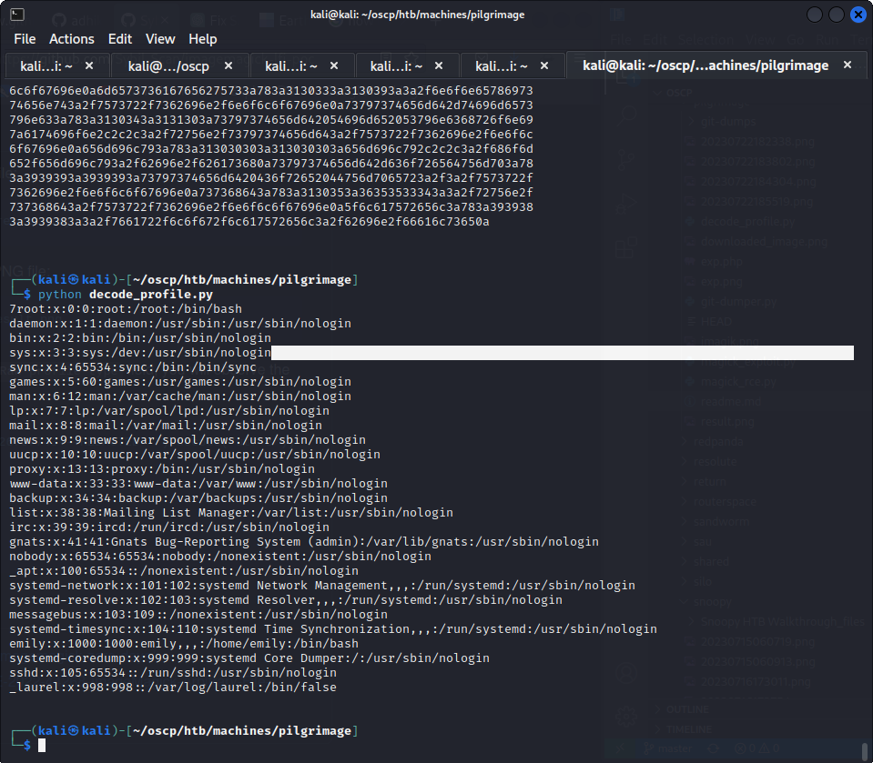

# ImageMagick-lfi-poc
### ImageMagick Arbitrary Read Files - CVE-2022-44268

also used in htb pilgrimage

## ImageMagick LFI PoC [CVE-2022-44268]


The researchers at [MetabaseQ](https://www.metabaseq.com/imagemagick-zero-days/) discovered CVE-2022-44268, i.e. ImageMagick 7.1.0-49 is vulnerable to Information Disclosure. When it parses a PNG image (e.g., for resize), the resulting image could have embedded the content of an arbitrary remote file (if the ImageMagick binary has permissions to read it).


Step 1 :

run

```
pip install pillow
sudo apt install graphicsmagick-imagemagick-compat
```

Step 2 ;

run

```
python3 magick_exploit.py generate -l [local_file] -o [output_file]
```

here in this case the local file is '/etc/passwd' which i want to get from the victim machine.

step 3 :

upload the image file on the website

step 4 :

get he converted image file from the website.
name it as 'downloaded_image.png'

step 5:

run 

```
python3 decode_profile.py
```



## Note

if there is some error like

```
 "/home/kali/codeplay/oscp/htb/machines/pilgrimage/decode_profile.py", line 8, in <module>
    profile = output_str.split("Raw profile type: \n\n    ")[1].split('Date:create:')[0]
              ~~~~~~~~~~~~~~~~~~~~~~~~~~~~~~~~~~~~~~~~~~~~~~^^^
IndexError: list index out of range

```

It means that the file you mentioned doesnt exist. Use `/etc/passwd` for sanity check. 

## Credits

1. https://github.com/adhikara13/CVE-2022-44268-MagiLeak
2. https://github.com/Sybil-Scan/imagemagick-lfi-poc


